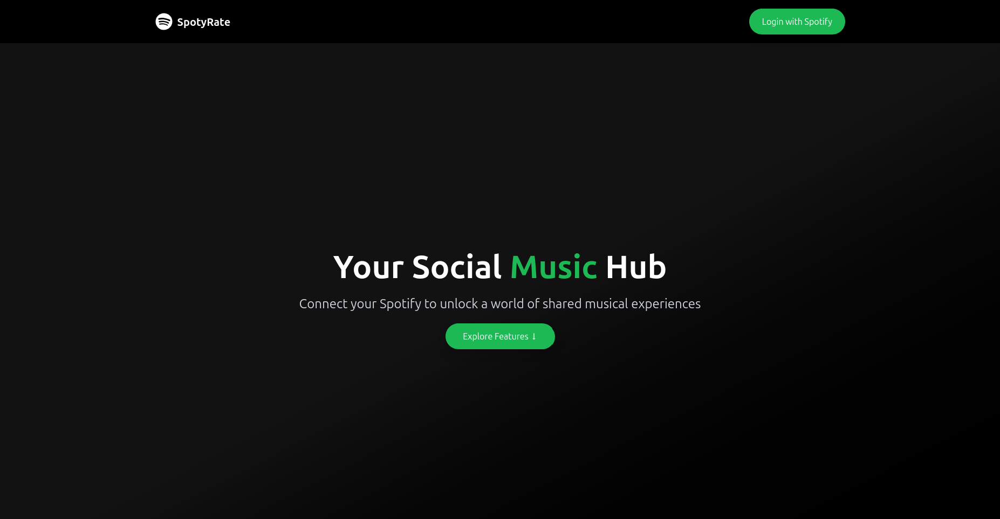
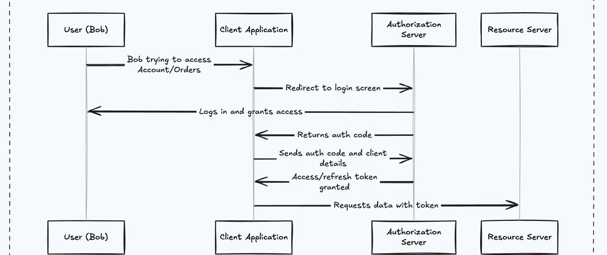
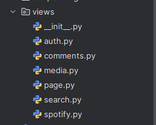
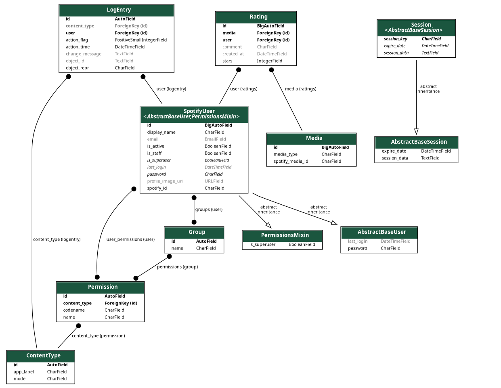
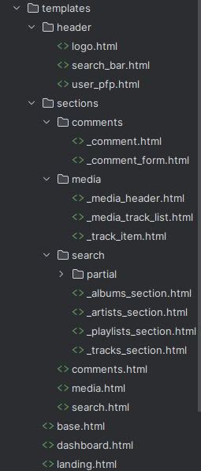
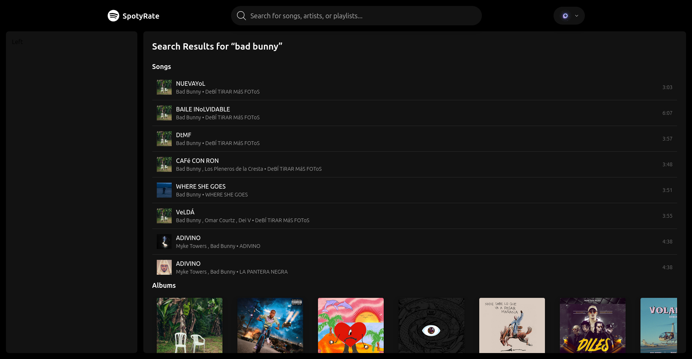
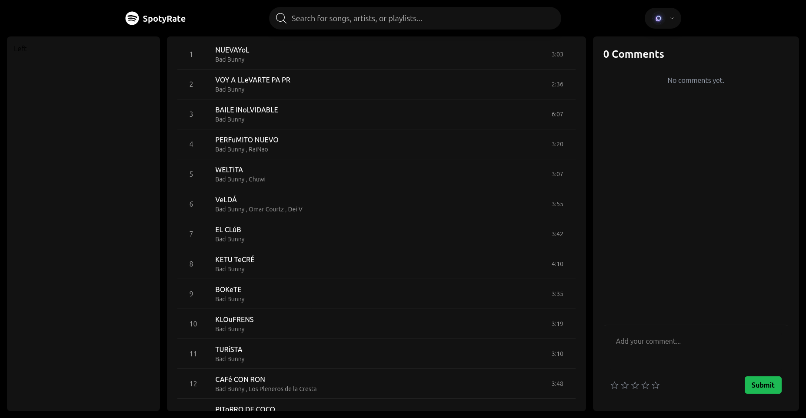
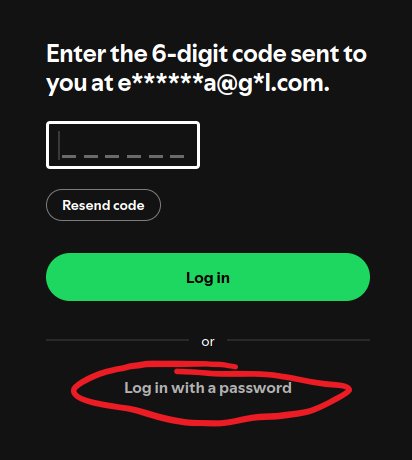

# SpotyRate



## Overview

SpotyRate is a web application that utilizes the Spotify API to enable users to rate, comment on, and share songs and playlists. The primary goal is to enhance interaction and communication among users who share similar musical tastes and preferences.

Inspired by Spotify's aesthetic, SpotyRate offers a familiar yet enriched experience by introducing social features that are often lacking on music streaming platforms. By allowing users to leave comments and rate songs and playlists, SpotyRate fills a gap typically seen in traditional social media functionalities.

In essence, SpotyRate aims to create a more interactive community for music enthusiasts by blending the Spotify experience with the social connectivity users crave.

---

### Key Features

* **Rating:** Rate songs and playlists using a star-based rating system to express personal opinions and preferences.
* **Comments:** Share comments and experiences associated with each song and playlist, fostering discussion and connection among users.
* **Friend System:** Connect directly with other users through SpotyRate’s built-in friend system, enabling social interactions without relying on third-party platforms.

---

# Implementation

This project is built using Django, leveraging its extensive library ecosystem to streamline backend development and facilitate rapid integration of essential features.

For the frontend, the initial approach involved custom CSS, but after encountering design and maintainability challenges, we transitioned to [Tailwind CSS](https://tailwindcss.com/), a utility-first framework that promotes modular and responsive design.

## Spotify Authentication

SpotyRate simplifies user authentication by exclusively utilizing Spotify's OAuth 2.0 Authorization Code Flow. This approach eliminates the need for separate app-specific credentials, streamlining the login process and enhancing user experience.

Upon initiating the login process, users are redirected to Spotify's authorization page, where they grant the application access to their account. After authorization, Spotify redirects users back to SpotyRate with an authorization code. This code is then exchanged for an access token, which is stored in the user's Django session, allowing seamless interaction with Spotify's API.

The authentication flow is illustrated below:



All authentication logic, including user registration and session management, is encapsulated within `views/auth.py`. This design ensures that each authenticated Spotify user is recorded in our database, enabling personalized features and interactions within the SpotyRate platform.


## Views

To maintain clarity and modularity in the project structure, SpotyRate organizes its views as a directory rather than a single `views.py` file. This approach allows us to compartmentalize features into distinct files, each focusing on a specific responsibility, making the codebase more maintainable and scalable as new features are integrated.

Below is the current structure of the `views` directory, illustrating how each file addresses a particular feature or functionality:



## Models

SpotyRate’s data model is structured to integrate seamlessly with Spotify’s user data while maintaining Django’s default authentication framework. Although the model diagram may seem complex at first glance, less than half of the tables are custom implementations.

We opted to extend the default Django `User` model by linking it to a custom `SpotifyUser` model. This approach allows us to leverage Django’s built-in authentication features, such as session management and permissions, while using Spotify as the primary authentication source.

The `SpotifyUser` model is identified by a unique `spotify_id` and stores essential user information, including their display name, email, and profile image. This structure ensures that our user data remains synchronized with Spotify while maintaining compatibility with Django’s authentication system.

User management is handled by the `SpotifyUserManager` class in `manager.py`. This class is responsible for creating new users and superusers based on Spotify data, allowing us to maintain a consistent authentication flow using OAuth tokens.

Below is the data model structure:



### Data Tables

* **SpotifyUser:** Stores essential user information obtained from Spotify, such as `spotify_id`, email, and profile image.
* **Rating:** Handles user ratings and comments, linking a `SpotifyUser` to a specific media item. Each entry includes the rating value, comment text, and timestamps.
* **Media:** Consolidates songs, albums, and playlists into a single table. Each media item is identified by a Spotify `media_id` and a `media_type` field (e.g., song, album, playlist).

Initially, we had separate tables for Song, Album, and Playlist, each storing only the `media_id`. To reduce redundancy and simplify query logic, these were merged into the `Media` table with a `media_type` field for differentiation. This approach not only streamlines the data model but also optimizes the backend implementation.

---

## Templates (HTML)

Templates play a crucial role in defining the structure and presentation of a web application. From the start, we adopted a well-organized approach to structuring our HTML templates, leveraging Django’s advanced template inheritance features. This modular design allows us to focus on individual components, speeding up frontend development and ensuring consistency across pages.



Thanks to this organization and the use of Tailwind CSS, we were able to rapidly develop a clean, responsive interface that closely resembles Spotify’s sleek UI, delivering an intuitive and visually appealing user experience.

## AJAX Integration

Since all the content displayed on SpotyRate is fetched dynamically from the Spotify API, it’s essential to update the page content without full browser reloads to provide a smooth user experience.

AJAX enables asynchronous requests to Spotify’s API, allowing us to fetch and update content seamlessly. This setup lets us focus on creating flexible, generic HTML templates and CSS styling, while dynamically formatting and inserting Spotify’s data to match our UI. As a result, users enjoy real-time updates and interactive features without unnecessary page refreshes.



## Comments System

The comments feature enables users to submit and view ratings (1 to 5 stars) and textual feedback on any Spotify media item — whether it’s a track, playlist, or album. This functionality boosts interactivity by fostering user-generated content and community engagement around shared musical interests.



### How It Works

The comments system is powered by two main views located in `comments.py`:

* **`media_comments(request)`**
  This AJAX-only GET view fetches all comments associated with a specific media ID. It returns an HTML snippet with user comments sorted from newest to oldest, enabling dynamic content updates without page reloads.

* **`submit_comment(request)`**
  Handles comment submissions via AJAX POST requests. The request payload must include:

  * `mediaId` (Spotify ID of the media item)
  * `mediaType` (track, playlist, or album)
  * `stars` (integer rating from 1 to 5)
  * `comment` (optional text)

  This view validates the data, ensures the related media object exists (creating it if necessary), and links the comment to the logged-in user. To maintain a clean user experience, each user can only submit one comment per media item — subsequent submissions update the existing comment rather than creating duplicates.

* **`remove_comment(request)`**
  Allows users to delete their own comments. Using the Django session, the system verifies that the delete request is made by the comment’s author before removing the comment from the database.

All these views respond with `JsonResponse` objects to facilitate smooth JavaScript integration and real-time updates without full page refreshes.

<p align="center">  
    
  &nbsp;&nbsp;&nbsp;  
    
</p>

### URL Integration

These views are exposed via the following routes in `urls.py`:

```python
path('api/comment/fetch/', views.media_comments, name='api-media-comments'),
path('api/comment/submit/', views.submit_comment, name='api-submit-comments'),
```

---

# How to Deploy

SpotyRate uses Spotify authentication to streamline the login process and prevent multiple login prompts. This integration enables direct interaction with Spotify data.

### Demo Account

To test the application, use the following demo account credentials:

* **Email:** [spotyratedemo@gmail.com](mailto:spotyratedemo@gmail.com)
* **Password:** WebProject2025

If prompted for email verification, select the "Use Password" option or log in to Gmail using the same credentials.



### Admin Access

To access the Admin interface, use these credentials:

* **Username:** admin
* **Password:** admin

### Deployment

To deploy the application, you can use Docker Compose:

```bash
docker-compose build
docker-compose up
```

Alternatively, run the server directly using:

```bash
python3 manage.py runserver
```

### Environment Variables

Ensure that a `.env` file is created in the root directory with the following credentials (linked to the demo account):

```
CLIENT_ID=198fb21532784721aabf169a007fa26f
CLIENT_SECRET=dbb064ba49814f48aadba893a75eec2d
REDIRECT_URI=http://127.0.0.1:8000/callback/
DEBUG=True
```

Ensure that all configurations are properly set before deployment.