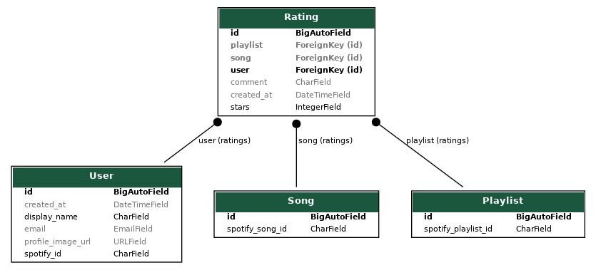

# SpotyRate

## Overview

SpotyRate is a web application that leverages the Spotify API to let users rate, comment, and share songs and playlists with other users. The main focus is to facilitate interaction and communication among users with similar musical tastes and preferences.

The application adopts a Spotify-inspired theme while incorporating new sections and features to enable users to express their opinions on specific songs and playlists.

### Key Features

* **Rating:** Rate songs using a star-based rating system.
* **Comments:** Share comments and experiences associated with each song and playlist.
* **Friends System:** Unlike Spotify, which relies on Facebook for social connections, SpotyRate implements its own friend system to connect users directly.

Below is the data model structure for the Rating and Comment features:



## How to Use

SpotyRate uses Spotify authentication to streamline the login process and prevent multiple login prompts. This integration enables direct interaction with Spotify data.

### Demo Account

To test the application, use the following demo account credentials:

* **Email:** [spotyratedemo@gmail.com](mailto:spotyratedemo@gmail.com)
* **Password:** WebProject2025

If prompted for email verification, select the "Use Password" option or log in to Gmail using the same credentials.

### Admin Access

To access the Admin interface, use these credentials:

* **Username:** admin
* **Password:** admin

### Deployment

To deploy the application, you can use Docker Compose:

```bash
docker-compose build
docker-compose up
```

Alternatively, run the server directly using:

```bash
python3 manage.py runserver
```

### Environment Variables

Ensure that a `.env` file is created in the root directory with the following credentials (linked to the demo account):

```
CLIENT_ID=198fb21532784721aabf169a007fa26f
CLIENT_SECRET=dbb064ba49814f48aadba893a75eec2d
REDIRECT_URI=http://127.0.0.1:8000/callback/
DEBUG=True
```

Ensure that all configurations are properly set before deployment.

## Spotify User Integration & Media Unification

This project includes a custom integration between Spotify authentication and the Django user system, as well as a unified approach for handling Spotify media types (tracks, playlists, albums).

### SpotifyUser as Django User

We replaced the default Django user with a custom `SpotifyUser` model. This model authenticates users using their Spotify account via the unique `spotify_id`. It stores key user info such as their display name, email, and profile image. This custom user model integrates cleanly with Django’s authentication and permissions system.

The `SpotifyUserManager` class (in `manager.py`) is responsible for creating regular users and superusers from Spotify data. This ensures our user flow is completely based on Spotify OAuth and simplifies the handling of user sessions in the backend.

### Unified Media Model

The `Media` model abstracts over Spotify media items, such as tracks, playlists, and albums. Each media object is identified by its unique Spotify ID and tagged with a `media_type` field. This unification avoids duplicating models and logic for each media category.

To complement this, the `media.py` module handles Spotify API interactions:
- `get_spotify_data`: A helper that fetches raw Spotify data given a media type and ID.
- `normalize_track`, `normalize_playlist`, and `normalize_album`: Functions that process and standardize Spotify's response structure into a consistent format for rendering.
- `media_view`: A Django view that fetches and displays the selected media, using the unified normalization pipeline.

### Ratings Linked to Media

The `Rating` model links a `SpotifyUser` to a `Media` object with a star rating and optional comment. This allows users to express preferences and interact with all types of Spotify content in a unified way.
